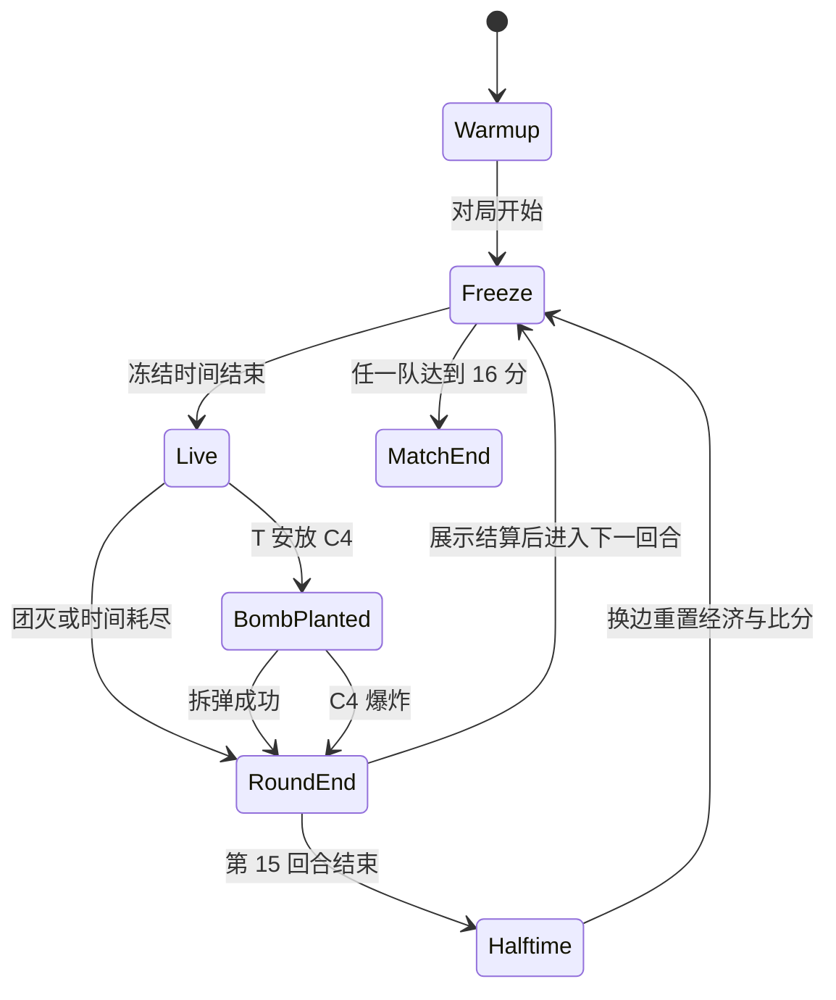
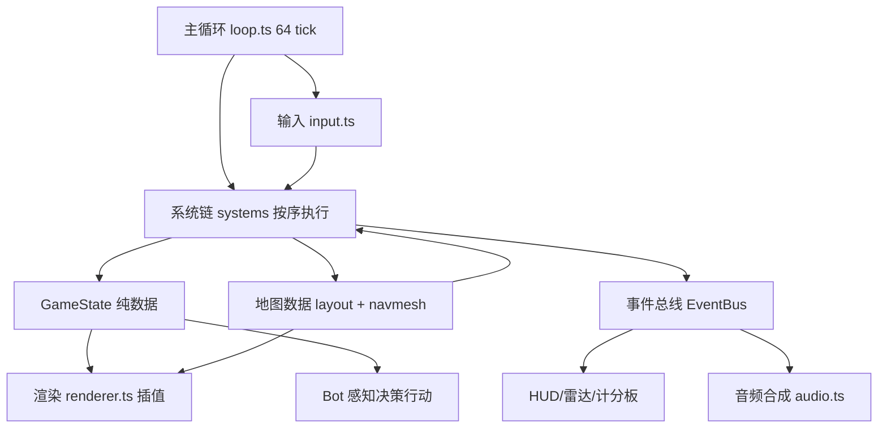

# 架构设计

## 系统概述

单进程浏览器应用，逻辑与渲染同帧驱动但职责分离。核心思路：**游戏状态（Game State）是纯数据，系统（System）按固定顺序消费与生产状态，渲染层每帧只读状态做插值呈现**。该结构使物理、经济、弹道全部可脱离浏览器单测，并为未来加入回放或联机保留确定性 tick 的可能。

固定 tick：逻辑 64 tick/秒（与主流竞技服务器 tick 一致），渲染与逻辑解耦，渲染帧间状态插值。

## 技术栈

- TypeScript 5 strict + Vite 5
- Three.js r160+（WebGL2 渲染）
- Vitest（单测）
- WebAudio（合成音效）

## 项目结构（建议）

```
/workspace
├── index.html
├── vite.config.ts
├── src/
│   ├── main.ts                 # 启动入口
│   ├── engine/                 # 引擎层（与玩法无关）
│   │   ├── renderer.ts         # Three.js 封装、相机、插值渲染
│   │   ├── input.ts            # 键鼠输入、PointerLock
│   │   ├── loop.ts             # 固定 tick 主循环（accumulator 模式）
│   │   ├── geometry/           # brush 构建、BVH、raycast
│   │   └── audio.ts            # WebAudio 合成器与空间化
│   ├── game/                   # 玩法层
│   │   ├── state.ts            # GameState 纯数据定义
│   │   ├── systems/            # 系统数组，按序执行
│   │   │   ├── movement.ts     # Source 风格运动物理
│   │   │   ├── weapon.ts       # 射击、后坐力、换弹、投掷
│   │   │   ├── combat.ts       # raycast 命中、伤害计算
│   │   │   ├── grenade.ts      # 投掷物弹道与区域效果
│   │   │   ├── round.ts        # 回合状态机
│   │   │   ├── economy.ts      # 金钱与购买
│   │   │   └── bot.ts          # Bot 感知-决策-行动
│   │   ├── entities/           # 玩家、C4、投掷物、掉落物
│   │   └── weapons.ts          # 武器数值表（数据驱动）
│   ├── map/                    # 地图数据与构建
│   │   ├── layout.ts           # 原创地图 brush 定义
│   │   ├── materials.ts        # 程序化材质生成
│   │   └── navmesh.ts          # Bot 导航网格
│   └── ui/                     # HUD（DOM + Canvas 混合）
│       ├── hud.ts
│       ├── buymenu.ts
│       ├── radar.ts
│       └── scoreboard.ts
└── tests/                      # Vitest 单测（物理/经济/伤害公式）
```

## 核心模块

### 1. 主循环（engine/loop）
accumulator 模式：每帧收集真实耗时，按 1/64s 步进执行逻辑系统链，剩余不足一步的时间留给渲染插值（alpha 因子）。逻辑与渲染彻底解耦。

### 2. 游戏状态（game/state）
全部可变玩法数据集中在一个 `GameState` 对象：玩家数组、实体数组、回合状态、比分、经济、C4 状态。系统是纯函数式的 `state -> state`（原地修改 + 事件产出），事件总线收集「射击/命中/死亡/安弹」等事件供 UI 与音效消费。

### 3. 运动物理（systems/movement）
Source 风格实现：
- 地面：`friction` 摩擦衰减 + `accelerate` 加速（目标速度与当前速度投影差限制）
- 空中：`airAccelerate` 低系数加速，产生 strafe 增速；跳起瞬间清空地面摩擦，落地帧内再次起跳（自动 bhop 窗口可配置）形成连跳
- 蹲：速度上限下调、碰撞盒降低、视角平滑下移；蹲跳实现登高
- 碰撞：AABB 扫掠碰撞 + 分离轴解算，支持站在移动实体上（本作静态地图为主，保留接口）

### 4. 武器与弹道（systems/weapon + systems/combat）
- 武器全部数据驱动（`weapons.ts` 数值表），运行时零硬编码分支
- 后坐力：每把枪一条固定 kick 序列（前几发上抬，后续横向漂移），视角反冲与准星扩散分离实现
- 散布：按「站定/移动速度/空中」三态查表得到锥角，raycast 在锥内随机取方向
- 命中：raycast 命中 BVH 场景与 hitbox 胶囊集合，取最近命中；部位倍率 → 距离衰减 → 护甲减免 → 扣血
- 穿透：命中薄墙时以衰减后伤害在延长线上继续投射（可配置层数）

### 5. 回合状态机（systems/round）



### 6. 经济系统（systems/economy）
事件驱动：击杀/回合结束事件携带金额入账；连败计数器驱动 loss bonus 阶梯（1400/1900/2400/2900/3400）；购买仅限冻结与购买时间内、且位于出生区。

### 7. Bot AI（systems/bot）
三层结构：感知（视野锥 + raycast 可见性 + 声音事件）→ 决策（有限状态机：rush 守包、默认卡点、回防、拆弹、economic buy）→ 行动（A* 路径跟随 + 瞄准模型：反应延迟 200-400ms、最大角速度、高斯瞄准误差随距离收敛）。Bot 使用与人类玩家完全相同的运动与武器系统，无特权。

### 8. 地图（map/）
- `layout.ts` 用 brush（AABB 列表 + 材质标签）描述原创布局：双爆破点、中路走廊、两条侧翼通道、高低差平台与掩体箱
- `materials.ts` 程序化生成贴图（Canvas 绘制噪声混凝土/金属/木纹/沙地），CanvasTexture 入 Three.js
- 光照：平行光 + 半球光 + 静态 AO（顶点烘焙），雾效增强纵深
- `navmesh.ts` 由 brush 地面自动栅格化 + A*

### 9. 音效（engine/audio）
WebAudio OscillatorNode/NoiseBuffer 合成：枪声（噪声爆发 + 低频冲击 + 按武器调滤波）、C4 滴答、爆炸（低频轰鸣 + 失真）、脚步（按材质切换滤波）。PannerNode 空间化，随距离/遮挡衰减。

## 架构图



## 关键流程

### 一次射击
1. 玩家按下开火 → 输入系统写入意图
2. weapon 系统：校验冷却/弹药/状态 → 播放 kick（视角反冲）→ 生成射击事件
3. combat 系统：锥内随机方向 raycast → 命中 hitbox/墙体 → 部位倍率与衰减计算 → 扣血/致死 → 产出命中/击杀事件
4. 事件总线：HUD hitmarker、音效、击杀信息流、经济入账

### 一回合
冻结期（买枪）→ live（战略移动/交战/安弹）→ C4 倒计时（40s）→ 拆弹或爆炸 → 回合结算（经济、比分、尸体清理）→ 下一回合；第 15 回合后半场换边。

## 设计决策

| 决策 | 理由 |
|------|------|
| 渲染层用 Three.js，玩法层全自研 | 复刻效果的精髓在运动物理、弹道、经济、Bot，全在玩法层；渲染是成熟问题，自研引擎数万行只花在阴影/后处理上，对手感贡献为零。渲染用轮子，省下全部预算砸进打磨 |
| 自研运动物理而非用现成物理引擎 | bhop/strafe 的手感来自对加速度与摩擦公式的精确控制，通用引擎（cannon/rapier）的角色控制器表达不了 air accelerate 语义 |
| 逻辑 64 tick 固定步长 | 与手感调参数值解耦渲染帧率；为回放/确定性留后路 |
| GameState 纯数据 + 系统链 | 全部数值公式可脱离浏览器单测，AI 能力验证场景下可批量回归 |
| 武器数据驱动 | 新增武器只改数值表，便于对齐机制细节 |
| 程序化资产 | 满足原创性硬约束，同时保证体积小、加载快 |
| DOM/Canvas HUD 而非 WebGL 内嵌 UI | 文本/雷达/菜单用 DOM 渲染效率与开发效率更高，与 WebGL 画布分层叠加 |

## 复刻效果优先级

预算按"对复刻效果的贡献"分配，打磨轮次是正式里程碑而非收尾工作：

1. **运动手感（P0）**: air accelerate / 摩擦 / bhop 窗口的公式必须精确，参数化支持逐 tick 验证
2. **射击手感（P0）**: recoil pattern 固定序列 + 四态散布 + 部位倍率 + 距离衰减 + 穿透衰减，全部数值可单测
3. **回合节奏（P0）**: 经济博弈数值链（击杀奖励差异/连败补偿/上限）+ C4 全流程计时
4. **武器库广度（P1）**: 首发 6 把覆盖 4 类（手枪/步枪/狙击/冲锋），打磨期扩到 12+ 把，每把机制差异化（射速/衰减/穿透/移速惩罚）
5. **Bot 拟人（P1）**: 反应延迟分布、角速度上限、距离误差收敛、道具使用，对手质量决定单机体验上限
6. **视听反馈（P1）**: 枪口火光、弹壳抛射、命中 hitmarker 与音调反馈、脚步材质区分、C4 滴答加速——反馈密度即手感
7. **地图打磨（P2）**: 掩体视线阻断验证、双点位攻防平衡迭代

## 里程碑规划

| 里程碑 | 内容 | 验收标准 |
|--------|------|----------|
| M0 脚手架 | Vite + TS + Three.js + 主循环 + 输入 | 浏览器打开可进入 pointer-lock 视角，WASD 移动带碰撞，稳定 60fps |
| M1 运动手感 | 摩擦/加速/空中加速/蹲/静走/梯子 | 单测覆盖物理公式；试玩可完成 bhop 连跳增速、蹲跳上箱 |
| M2 射击核心 | 6 把武器（4 类覆盖）+ 弹道 + hitbox + 靶场盒景 | 靶场可命中头/躯干不同倍率；后坐力 pattern 可视化与数值单测通过 |
| M3 回合骨架 | 经济 + 回合状态机 + C4 + HUD | 可完成一整回合：买枪、安弹、拆弹、结算入账正确 |
| M4 完整地图 | 原创双爆破点地图 + 材质光照 + 导航网格 | 地图可玩、雷达正确显示、Bot 可寻路到达任意点 |
| M5 人机对局 | Bot 状态机 + 瞄准模型 + 完整 MR15 对局 | 5v5 完整一局（含换边）无需人工干预可打完 |
| M6 投掷物 | 4 种投掷物弹道与区域效果 + Bot 道具使用 | 闪光/烟雾/高爆/燃烧全流程，Bot 会用道具配合进攻 |
| M7 视听反馈 | 合成音效全套 + 枪口火光 + 弹壳 + hitmarker | 枪声/脚步/C4/爆炸空间化，反馈密度达到"开枪有手感" |
| M8 武器库扩充 | 12+ 把武器全数值 + 检视与购买菜单完成 | 每把枪机制差异化可感知，经济体系覆盖全武器 |
| M9 打磨轮 | Bot 拟人化迭代 + 地图攻防平衡 + 手感参数终调 | 盲测试玩：移动/射击/节奏不违和，Bot 对抗有来有回 |

每个里程碑交付一个可运行、可在线预览的版本。M7 起进入打磨循环，按试玩反馈滚动迭代，效果达标即收口。
