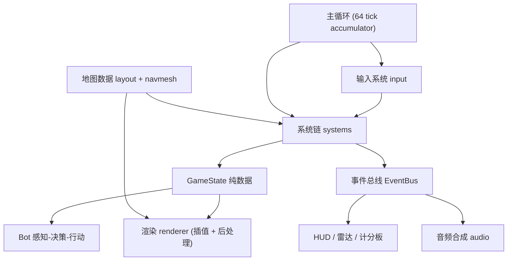
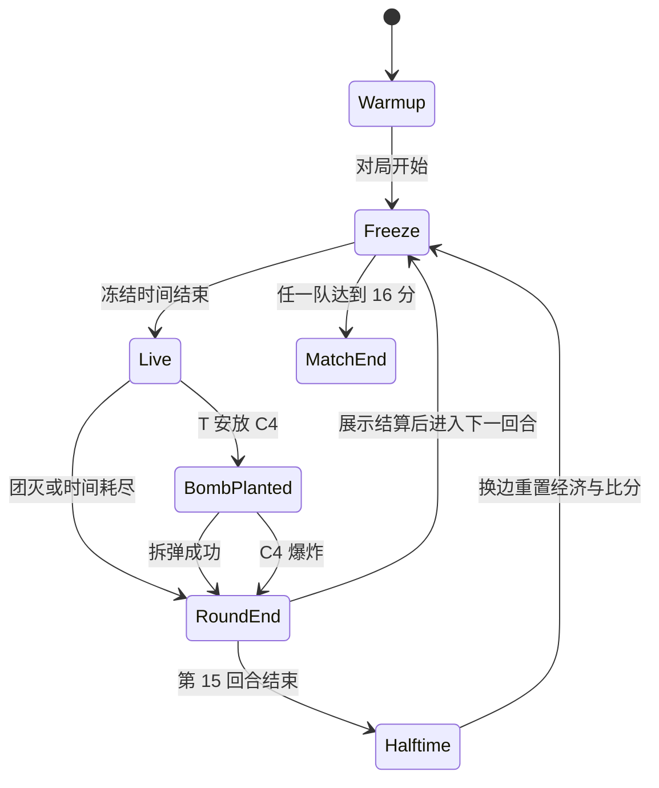

# STRIKE PROTOCOL 技术设计

Feature Name: strike-protocol
Updated: 2026-09-17

## Description

单进程浏览器 FPS 应用。逻辑层（GameState 纯数据 + 系统链）以固定 64 tick 运行，渲染层（Three.js）每帧只读状态做插值，UI（DOM）与音频（WebAudio）消费事件总线。玩法机制 100% 自研，渲染用 Three.js 轮子，资产全程序化。本设计将需求（requirements.md R1-R13）映射到模块、接口、不变量与测试策略，实现顺序遵循 ARCHITECTURE.md 里程碑 M0-M9。

## Architecture

### 总览

依赖方向硬约束：`ui -> game -> engine`，`map -> engine`；game 层禁止 import Three.js；engine 层禁止 import game 层。

### 系统链执行顺序（每 tick）

固定顺序保证确定性：同种子 + 同输入序列 ⇒ 任意 tick 状态可复现，为回放与数值回归测试提供基础。

### 回合状态机

### Bot 三层结构

## Components and Interfaces

完整类型签名以 `.monkeycode/docs/INTERFACES.md` 为单一事实来源，此处记录关键契约与本次设计的绑定关系：

| 组件 | 契约 | 覆盖需求 |
|------|------|----------|
| `loop.ts` | accumulator + tick 丢弃上限（10 tick） | R1 |
| `input.ts` | 意图快照写入 GameState.input，pointer lock 管理 | R2 |
| `systems/movement.ts` | 摩擦/空中加速/bhop 窗口/蹲/梯/坠落伤害，公式仅读 CONFIG | R3 |
| `systems/weapon.ts` | 冷却校验、recoilIndex 推进、四态散布、换弹 | R4 |
| `systems/combat.ts` | BVH raycast + hitbox 部位 + 距离衰减 + 护甲 + 穿透 | R5 |
| `systems/round.ts` | 上表状态机，计时全部走 tick 不挂 wall clock | R7 |
| `systems/economy.ts` | 事件驱动入账，lossStreak → lossBonus 阶梯，16000 钳制 | R6 |
| `systems/grenade.ts` | 抛物线 + 反弹衰减 + 区域效果（爆/闪/烟/燃） | R10 |
| `systems/bot.ts` | 感知-决策-行动三层，参数全在 CONFIG.bot | R9 |
| `weapons.ts` | 数据驱动数值表，运行时零武器硬编码 | R4 R5 |
| `map/layout.ts` | 原创 brush 双爆破点地图，navmesh 栅格化 | R8 |
| `audio.ts` | WebAudio 合成 + PannerNode 空间化 | R12 |
| `ui/hud.ts` | DOM HUD + 雷达 Canvas + 计分板 + 购买菜单 | R11 |
| `debug.ts` | 仅 DEV 构建挂载 `window.__game` | R13 |

系统统一签名：`update(state, events, dt)`；事件类型见 INTERFACES.md `GameEvent`。

## Data Models

- **GameState**: 玩家数组（PlayerState）、实体数组（C4/投掷物/掉落物）、RoundState、比分、事件缓冲。渲染插值双缓冲（prev/current）。
- **PlayerState**: position（脚底中心）/velocity/yaw/pitch/flags/health/armor/money/weapons/activeSlot/alive/recoilIndex。
- **WeaponDef**: 数据表条目，含 recoilPattern 固定序列与三态 spread 锥角。
- **RoundState**: phase/phaseEndTick/roundNumber/score/lossStreak/bomb（状态、安放与拆除进度、爆炸 tick）。
- **Brush/MapDef**: AABB + 材质标签 + bombsite 区域 + spawn；navGrid 运行时栅格化生成。
- **CONFIG**: 全部可调数值集中（tickRate 64、moveMaxSpeed 250、jumpImpulse 301.993、bhopWindowMs 40、fallDamageThreshold 580、c4TimerMs 40000、defuseMs 10000、freezeMs 5000、buyTimeMs 20000、roundTimeMs 115000、maxMoney 16000、lossBonus 阶梯、headshotMultiplier 4、winRounds 16、teamSize 5）。单测与调参共用此表。

## Correctness Properties

不变量（单测逐 tick 断言）：

1. `0 <= player.money <= 16000`；经济入账与消费后立刻钳制。
2. `player.health > 0` 当且仅当 `player.alive`。
3. `0 <= ammoMag <= magazine`；换弹期间射击被拒绝。
4. 速度上限：地面/空中/蹲下各态水平速度不超对应 cap + 浮点容差 0.01。
5. bhop 窗口：落地 tick 起 40 ms 内的跳跃意图均触发再起跳；窗口外不触发。
6. 确定性：同种子同输入回放 N tick，状态哈希一致。
7. 回合计时单调：`phaseEndTick` 只随 tick 推进，事件不回填。
8. Bot 无特权：Bot 的运动与武器调用路径与人类玩家同一函数入口，参数一致。
9. 数值单一来源：物理/伤害/经济公式只引用 CONFIG 与 weapons.ts，源码中无散落魔法数字（CI lint 规则）。

## Error Handling

| 场景 | 策略 |
|------|------|
| WebGL2 上下文创建失败 | 渲染降级说明页，提示换浏览器；逻辑层仍可 headless 运行（测试模式） |
| AudioContext 被浏览器挂起 | 首次用户手势（点击画布）时 resume，未就绪期间音效静默丢弃不阻塞 |
| 角色速度出现 NaN/Infinity | 单 tick 检测守卫，回写生成点并记录日志 |
| 角色跌出地图包围盒 | 视为坠落致死，按淘汰处理 |
| Bot A* 无解 | 回退到最近可走点巡逻，下一 tick 重试 |
| 购买菜单交易失败（余额/窗口/区域） | 拒绝交易，HUD 高亮提示原因 |
| 武器数据校验失败 | 回退小刀，控制台输出字段级错误 |

## Test Strategy

| 层 | 工具 | 内容 |
|----|------|------|
| 运动物理 | Vitest | 逐 tick 输入序列断言速度曲线：摩擦收敛值、air accel 上限、bhop 窗口边界 tick |
| 弹道伤害 | Vitest | 纯函数断言：部位倍率、距离衰减分段、护甲公式、穿透层数 |
| 经济 | Vitest | 状态转移：击杀奖励差、lossStreak 阶梯、16000 钳制、购买窗口 |
| 回合状态机 | Vitest | 全 phase 迁移遍历 + C4 计时 + 换边重置断言 |
| Bot | Vitest | 网格采样可达性；瞄准误差分布（均值/方差统计断言） |
| 确定性 | Vitest | 固定种子回放 10000 tick，状态哈希比对 |

纪律：公式改动必须同提交附测试更新（CI 门禁）。M2 起测试为合入门槛。

## References

- [^1]: (.monkeycode/docs/ARCHITECTURE.md) - 系统架构与里程碑 M0-M9
- [^2]: (.monkeycode/docs/INTERFACES.md) - 核心类型签名与 CONFIG 数值基准
- [^3]: (.monkeycode/docs/DEVELOPER_GUIDE.md) - 开发规范、依赖方向与测试纪律
- [^4]: (.monkeycode/specs/strike-protocol/requirements.md) - 本文档对应需求（R1-R13）
